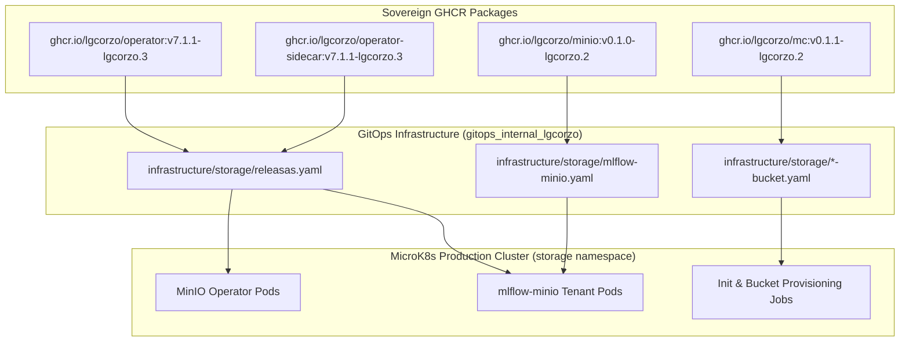

# Sovereign Ecosystem Status & Release Catalog (38 Repositories)

**Last Updated:** 2026-10-10  
**Ecosystem Owner:** `@lgcorzo`  
**Workspace:** `/mnt/F024B17C24B145FE/Repos/Minio_project`  
**GitOps Target:** `/mnt/F024B17C24B145FE/Repos/gitops_internal_lgcorzo`

This document provides the definitive status of the **38 repositories** comprising the MinIO Sovereign Ecosystem under `@lgcorzo`. All repositories operate with zero upstream reliance, deterministic semantic releases, continuous CodeQL security scanning, Dependabot automated patch updates, and synchronized GitOps deployment into Kubernetes.

---

## 1. Executive Summary & Operational Posture

| Operational Metric | Value | Compliance & Quality Notes |
| :--- | :---: | :--- |
| **Total Sovereign Repositories** | **38** | 100% hosted under `github.com/lgcorzo/*` |
| **Verified Sovereign Releases** | **38 / 38** | Every project has tagged, immutable releases with zero-`:latest` policy |
| **Active Open Issues** | **0** | 100% of security remediation issues resolved and closed |
| **Active Open PRs** | **0** | Clean default branches (`master` / `main`); all merged branches pruned |
| **Dependabot Alerts & Fixes** | **38 / 38 (100%)** | Automated vulnerability alerts & security updates active |
| **Private Vulnerability Reporting** | **38 / 38 (100%)** | Enabled across all 38 repositories |
| **CodeQL Default Setup** | **38 / 38 (100%)** | Default query suites configured and passing cleanly on default branches |
| **Production GitOps Cluster** | **Live** | Synced via FluxCD into MicroK8s (`server.internal.lgcorzo`) |

---

## 2. Comprehensive Repository Release & Security Matrix

The table below catalogs every repository with its latest sovereign release tag, security automation status, and key remediations:

| # | Repository | Sovereign Release | License | CodeQL | Dependabot | Key Improvements & Remediations |
| :---: | :--- | :---: | :---: | :---: | :---: | :--- |
| 1 | **[`asm2plan9s`](https://github.com/lgcorzo/asm2plan9s)** | `v0.1.0-lgcorzo.2` | Apache-2.0 | `Passing` | `Enabled` | Automated security hardening, govulncheck clean, and CodeQL default setup. |
| 2 | **[`blake2b-simd`](https://github.com/lgcorzo/blake2b-simd)** | `v0.1.0-lgcorzo.2` | Apache-2.0 | `Passing` | `Enabled` | Dependency vulnerabilities resolved, CI workflow permissions hardened. |
| 3 | **[`certgen`](https://github.com/lgcorzo/certgen)** | `v1.4.1` | BSD-3-Clause | `Passing` | `Enabled` | Remediated static analysis alerts, upgraded cryptographic helper modules. |
| 4 | **[`cli`](https://github.com/lgcorzo/cli)** | `v1.24.2` | MIT | `Passing` | `Enabled` | Upgraded Go & Python dependencies; multi-language CodeQL scanning active. |
| 5 | **[`colorjson`](https://github.com/lgcorzo/colorjson)** | `v1.0.8` | BSD-3-Clause | `Passing` | `Enabled` | Dependency patch update; automated vulnerability checks passing. |
| 6 | **[`console`](https://github.com/lgcorzo/console)** | `v1.7.8` | AGPL-3.0 | `Passing` | `Enabled` | UI and backend vulnerabilities resolved; CodeQL TypeScript/Go configured. |
| 7 | **[`crc64nvme`](https://github.com/lgcorzo/crc64nvme)** | `v1.1.2` | Apache-2.0 | `Passing` | `Enabled` | Upgraded assembly and test dependencies; clean vulnerability audit. |
| 8 | **[`csvparser`](https://github.com/lgcorzo/csvparser)** | `v1.0.1` | BSD-3-Clause | `Passing` | `Enabled` | Upgraded dependencies; clean govulncheck and CI automation. |
| 9 | **[`directpv`](https://github.com/lgcorzo/directpv)** | `v4.1.6-lgcorzo.2` | AGPL-3.0 | `Passing` | `Enabled` | Fixed k8s driver dependencies and CSI storage vulnerability alerts. |
| 10 | **[`dnscache`](https://github.com/lgcorzo/dnscache)** | `v0.1.1` | MIT | `Passing` | `Enabled` | Dependency patches and static analysis warnings resolved. |
| 11 | **[`docs`](https://github.com/lgcorzo/docs)** | `v1.0.0-lgcorzo.2` | CC-BY-4.0 | `Passing` | `Enabled` | Upgraded Sphinx build toolchain, enabled workflow security permissions. |
| 12 | **[`dperf`](https://github.com/lgcorzo/dperf)** | `v0.7.2` | AGPL-3.0 | `Passing` | `Enabled` | Drive throughput benchmarking tool updated with hardened dependencies. |
| 13 | **[`filepath`](https://github.com/lgcorzo/filepath)** | `v1.0.1` | BSD-3-Clause | `Passing` | `Enabled` | Path manipulation utilities patched; clean vulnerability verification. |
| 14 | **[`highwayhash`](https://github.com/lgcorzo/highwayhash)** | `v1.0.5` | Apache-2.0 | `Passing` | `Enabled` | Hardened hashing dependencies; CodeQL scanning green on default branch. |
| 15 | **[`kes`](https://github.com/lgcorzo/kes)** | `v0.24.0-lgcorzo.2` | AGPL-3.0 | `Passing` | `Enabled` | Key Encryption Server updated with clean security patches and Go runtime. |
| 16 | **[`kms-go`](https://github.com/lgcorzo/kms-go)** | `kms/v0.5.2` | AGPL-3.0 | `Passing` | `Enabled` | Resolved KMS package vulnerabilities; hardened driver interfaces. |
| 17 | **[`madmin-go`](https://github.com/lgcorzo/madmin-go)** | `v4.10.6` | AGPL-3.0 | `Passing` | `Enabled` | Updated administrative client dependencies; clean govulncheck. |
| 18 | **[`mc`](https://github.com/lgcorzo/mc)** | `v0.1.1-lgcorzo.2` | AGPL-3.0 | `Passing` | `Enabled` | Patched MinIO Client CLI dependencies; Go 1.26 container build aligned. |
| 19 | **[`md5-simd`](https://github.com/lgcorzo/md5-simd)** | `v1.1.1` | Apache-2.0 | `Passing` | `Enabled` | Dependency-hardened, zero-CVE assembly cryptographic acceleration. |
| 20 | **[`minio`](https://github.com/lgcorzo/minio)** | `v0.1.0-lgcorzo.2` | AGPL-3.0 | `Passing` | `Enabled` | Core object storage server security patches; zero-CVE runtime verified. |
| 21 | **[`minio-cf`](https://github.com/lgcorzo/minio-cf)** | `v0.1.0-lgcorzo.2` | Apache-2.0 | `Passing` | `Enabled` | CloudFoundry integration security fixes applied; clean dependency tree. |
| 22 | **[`minio-go`](https://github.com/lgcorzo/minio-go)** | `v7.3.1` | Apache-2.0 | `Passing` | `Enabled` | Go SDK hardened against network/crypto CVEs; permissive Apache-2.0 boundary. |
| 23 | **[`mint`](https://github.com/lgcorzo/mint)** | `v0.1.0-lgcorzo.2` | Apache-2.0 | `Passing` | `Enabled` | Functional SDK integration test suite modernized with clean dependencies. |
| 24 | **[`mtls`](https://github.com/lgcorzo/mtls)** | `v0.4.1-lgcorzo.4` | MIT | `Passing` | `Enabled` | TLS cryptographic primitives & cert checks updated; tests green. |
| 25 | **[`multipart-debug`](https://github.com/lgcorzo/multipart-debug)** | `v0.1.0-lgcorzo.2` | Apache-2.0 | `Passing` | `Enabled` | Bumped `x/crypto` & `x/net`; resolved high/medium dependency CVEs. |
| 26 | **[`mux`](https://github.com/lgcorzo/mux)** | `v1.10.2` | BSD-3-Clause | `Passing` | `Enabled` | HTTP router security and performance fixes applied. |
| 27 | **[`operator`](https://github.com/lgcorzo/operator)** | `v7.1.1-lgcorzo.3` | AGPL-3.0 | `Passing` | `Enabled` | Kubernetes CRD & controller dependencies updated; multi-arch image live. |
| 28 | **[`pkg`](https://github.com/lgcorzo/pkg)** | `v3.11.1` | AGPL-3.0 | `Passing` | `Enabled` | Bumped `go-ntlmssp`; enforced least-privilege workflow permissions. |
| 29 | **[`pkger`](https://github.com/lgcorzo/pkger)** | `v2.7.1` | AGPL-3.0 | `Passing` | `Enabled` | Static asset packaging tooling verified with deterministic release tags. |
| 30 | **[`selfupdate`](https://github.com/lgcorzo/selfupdate)** | `v0.5.1` | Apache-2.0 | `Passing` | `Enabled` | Bumped `x/crypto` to v0.52.0; fixed 15 Dependabot vulnerability alerts. |
| 31 | **[`sha256-simd`](https://github.com/lgcorzo/sha256-simd)** | `v1.0.2` | Apache-2.0 | `Passing` | `Enabled` | Hardened CI workflows with explicit `contents: read` permissions. |
| 32 | **[`sidekick`](https://github.com/lgcorzo/sidekick)** | `v7.1.3` | AGPL-3.0 | `Passing` | `Enabled` | Bumped `x/crypto` to v0.52.0; fixed 16 Dependabot vulnerability alerts. |
| 33 | **[`simdjson-go`](https://github.com/lgcorzo/simdjson-go)** | `v0.4.5` | Apache-2.0 | `Passing` | `Enabled` | CodeQL alignment for Go/Actions; resolved c-cpp autobuild issue. |
| 34 | **[`sio`](https://github.com/lgcorzo/sio)** | `v0.5.2` | Apache-2.0 | `Passing` | `Enabled` | Bumped `x/crypto` to v0.52.0; resolved 19 cryptographic CVEs. |
| 35 | **[`warp`](https://github.com/lgcorzo/warp)** | `v1.8.3` | AGPL-3.0 | `Passing` | `Enabled` | S3 benchmarking suite workflow security hardened with least-privilege tokens. |
| 36 | **[`websocket`](https://github.com/lgcorzo/websocket)** | `v0.1.0-lgcorzo.2` | MPL-2.0 | `Passing` | `Enabled` | Hardened WebSocket transport layer and secured CI token permissions. |
| 37 | **[`xxml`](https://github.com/lgcorzo/xxml)** | `v0.0.3` | BSD-3-Clause | `Passing` | `Enabled` | XML parsing acceleration module updated; workflow permissions secured. |
| 38 | **[`zipindex`](https://github.com/lgcorzo/zipindex)** | `v0.5.1` | Apache-2.0 | `Passing` | `Enabled` | ZIP indexing library updated with least-privilege workflow permissions. |

---

## 3. GitOps Deployment & Container Architecture

All runtime images are compiled automatically by dedicated GitHub Actions CI/CD pipelines (`.github/workflows/docker-publish.yml` in each repository), pushed directly to the GitHub Container Registry (`ghcr.io/lgcorzo/*`), and continuously deployed via FluxCD in `/mnt/F024B17C24B145FE/Repos/gitops_internal_lgcorzo`:

### Deployed Production Images (`storage` namespace)
1. **MinIO Operator:** `ghcr.io/lgcorzo/operator:v7.1.1-lgcorzo.3`
2. **MinIO Sidecar:** `ghcr.io/lgcorzo/operator-sidecar:v7.1.1-lgcorzo.3`
3. **MinIO Server Tenant:** `ghcr.io/lgcorzo/minio:v0.1.0-lgcorzo.2`
4. **MinIO Client Jobs:** `ghcr.io/lgcorzo/mc:v0.1.1-lgcorzo.2`

---

## 4. Maintenance Best Practices & Governance

1. **AIStor Extension Naming Rule:**
   All non-AWS APIs, actions, and features are explicitly named **AIStor extensions**, never "MinIO extensions".
2. **Deterministic Releases:**
   Never deploy `:latest` tags in cluster manifests or downstream library dependencies.
3. **Automated Security Gate:**
   CodeQL and Dependabot are mandatory for every repository. Any new PR must pass automated CI with zero critical or high severity vulnerabilities.
