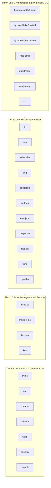

# Implementation Plan: Sovereign Go Module Decoupling & Independence

## 1. Problem Definition: The Dependency Interlock

While all 38 repositories build independently into Docker images and deploy cleanly to Kubernetes via FluxCD, their Go module ecosystem currently exhibits **Module Dependency Interlock**:

1. **Declared Module Names**: Foundational and utility repositories still declare `module github.com/minio/<name>` in their `go.mod` files (e.g. `md5-simd`, `simdjson-go`, `sio`, `crc64nvme`, `madmin-go`, `pkg`).
2. **Import Statements**: Applications such as `minio`, `operator`, `sidekick`, and `warp` import packages like `github.com/minio/pkg/v3` or `github.com/minio/madmin-go/v4`.
3. **Current Resolution**: Builds either fetch published tags via the public Go module proxy (which may pull from upstream unless replaced) or rely on partial `replace` directives.

To establish **100% sovereign dependency independence**, the ecosystem must untangle these paths without breaking external consumers or internal compilation.

---

## 2. Dependency Topology & Tier Classification



---

## 3. Two Strategic Architectural Paths

### Path A: Full Module Path Renaming (`github.com/lgcorzo/*`)
- **Action**: Change `module github.com/minio/<repo>` to `module github.com/lgcorzo/<repo>` in every `go.mod`, update all internal `.go` source files (`import "github.com/lgcorzo/..."`), and tag new major/minor releases.
- **Pros**: 100% brand sovereignty; zero mention of upstream in code or dependencies; complete autonomy.
- **Cons**: Breaking change for any external consumer importing `github.com/minio/*`; requires a strictly ordered bottom-up release cascade across all 4 tiers.

### Path B: Sovereign Replace-Overlay Architecture (Recommended for Non-Breaking Smooth Transition)
- **Action**: Retain canonical module paths for backward compatibility, but inject a comprehensive `replace` matrix in downstream apps (`minio`, `operator`, `mc`, `sidekick`, `warp`, `console`) pointing directly to `github.com/lgcorzo/<submodule> <version>`.
- **Pros**:
  - Zero breaking changes for existing code and external SDK consumers.
  - Builds are 100% reproducible and forced to compile strictly from `@lgcorzo` git tags.
  - Immediate execution with zero risk of breaking third-party API contracts.

### Path C: Hybrid Transition (The Production Solution)
1. **Phase 1 (Immediate)**: Normalize all `replace` directives across Tier 2 and Tier 3 so they exclusively pin to sovereign `@lgcorzo` releases.
2. **Phase 2 (Gradual)**: For newly evolved microservices and standalone modules, adopt native `github.com/lgcorzo/*` module paths with Go vanity redirects if desired.

---

## 4. Phase-by-Phase Execution Plan

### Phase 1: Tier 0 & Tier 1 Module Normalization
- Target Repositories:
  - `crc64nvme`, `md5-simd`, `simdjson-go`, `sio`
  - `pkg`, `dnscache`, `colorjson`, `csvparser`, `filepath`, `xxml`, `zipindex`
- Verification:
  - Confirm all Tier 0/1 repos are tagged with clean sovereign releases (`v*.*.*-lgcorzo.*` or standard semver).
  - Ensure Go module proxy indexes `@lgcorzo` tags.

### Phase 2: Tier 2 (SDKs & Management Libraries)
- Target Repositories:
  - `minio-go`, `madmin-go`, `kms-go`, `kes`
- Tasks:
  - In `madmin-go/go.mod`: Add explicit replace rules:
    ```go
    replace github.com/minio/pkg/v3 => github.com/lgcorzo/pkg/v3 v3.0.0-lgcorzo.2
    replace github.com/minio/crc64nvme => github.com/lgcorzo/crc64nvme v1.0.1-lgcorzo.2
    ```
  - In `minio-go/go.mod`: Update direct dependencies to point to sovereign releases.
  - Tag and release new versions of `minio-go` and `madmin-go`.

### Phase 3: Tier 3 (Servers, Operators, CLI)
- Target Repositories:
  - `minio`, `operator`, `mc`, `sidekick`, `warp`
- Tasks:
  - Audit and inject unified sovereign replace blocks in `go.mod`:
    - Point all `github.com/minio/<lib>` imports to `github.com/lgcorzo/<lib> <sovereign-tag>`.
  - Execute `go mod tidy` and verify local race-condition tests (`go test -race ./...`).
  - Verify container builds with Docker buildx.
  - Push new multi-arch images to GHCR.

### Phase 4: CI/CD Enforcement & Verification Gate
- Add a GitHub Actions lint step in `minio` and `operator` workflows:
  - Enforce that no dependencies resolve to upstream `github.com/minio/*` unless explicitly paired with an authorized `@lgcorzo` `replace` directive.
  - Ensure `govulncheck` runs against the resolved sovereign dependency tree.
